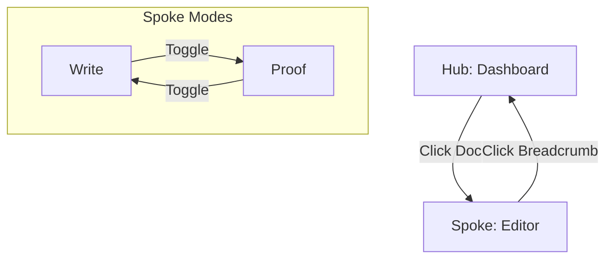

# このスキルでやること

LineaDocの新しいUXモデル「Hub & Spoke」に基づき、アプリケーションの主要モードと画面遷移を定義する。

# 設計思想: Focus & Context

従来のフラットなモード切替ではなく、階層的なナビゲーション構造を採用する。

## 1. ナビゲーションモード (マクロ)

| モード | 役割 | 画面構成 |
|--------|------|----------|
| **Hub (Dashboard)** | **探索と管理**。チーム・プロジェクトを俯瞰し、ドキュメントを探す。 | ダッシュボード (カードグリッド/リスト) |
| **Spoke (Editor)** | **執筆と作業**。特定のドキュメントを開き、集中して作業する。 | エディタ + 右コンテキストパネル |

## 2. ワークモード (ミクロ: Spoke内)

エディタ画面内での表示形式の切り替え。

| モード | 目的 | メインエリア | 右パネル |
|--------|------|-------------|-------------|
| **Write** | 執筆・履歴管理 | エディタ (BlockNote / Monaco) | Linea / Attributes (開閉可) |
| **Proof** | 出力確認 | 印刷プレビュー (A4) | テンプレート設定 |

---

# 画面遷移イメージ



# 実装方法

## ストア拡張: `appStore.ts`

```typescript
import { create } from 'zustand';

// マクロモードはURLルーティングで管理するため、ストアには持たない (Next.js App Router)
// /dashboard -> Hub
// /doc/[id]  -> Spoke

export type WorkMode = 'write' | 'proof';
export type RightPanelTab = 'history' | 'attributes' | 'graph' | null;

interface AppState {
  // Spoke内のワークモード
  workMode: WorkMode;
  setWorkMode: (mode: WorkMode) => void;
  
  // 右パネルの状態
  rightPanelTab: RightPanelTab;
  setRightPanelTab: (tab: RightPanelTab) => void;
  toggleRightPanel: (tab: RightPanelTab) => void;
}
```

## コンポーネント構成

### Hub (Dashboard)
`src/app/page.tsx` (または `src/app/dashboard/page.tsx`)
- `TeamTabs`: チーム切り替え
- `ProjectGrid`: プロジェクトカード
- `ProjectDialog`: プロジェクト作成

### Spoke (Editor)
`src/app/doc/[id]/page.tsx` (または `src/components/_layout/SpokeLayout.tsx`)
- `Header`: パンくずリスト、タイトル、設定ボタン
- `MainArea`: `SplitEditorLayout` (Write) または `ProofView` (Proof)
- `RightPanel`: `LineaPanel` (History), `FrontmatterForm` (Attributes)

# ショートカットキー

| キー | アクション |
|------|----------|
| `Alt + 1` | Hub (Dashboard) へ戻る |
| `Alt + 2` | Write モード (Editor) |
| `Alt + 3` | Proof モード (Preview) |
| `Alt + H` | Historyパネル開閉 |
| `Alt + I` | Attributesパネル開閉 |

# 禁止事項

- **モード切替でのデータ損失**: ページ遷移が発生する場合でも、オートセーブやローカルステートの同期を確実に行う。
- **深い階層**: ダッシュボードから2クリック以内でエディタに到達できるようにする。

# 完了条件

- [ ] `appStore.ts` が新しいモード定義に対応している。
- [ ] ダッシュボードとエディタのレイアウトが分離されている。
- [ ] 右パネルが開閉可能で、コンテンツがリサイズされる。
